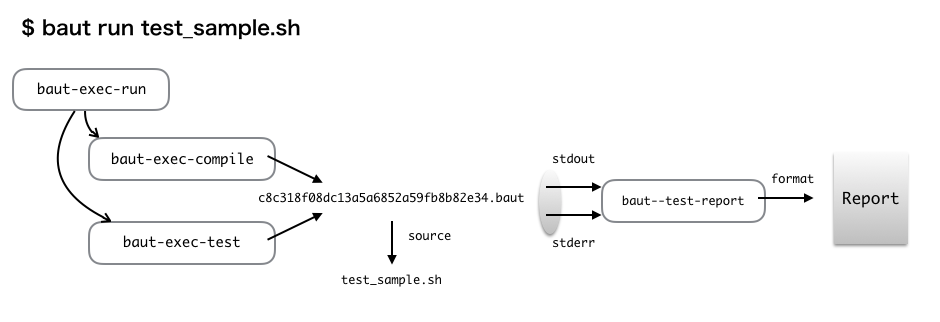

============
Introduction
============

Baut is a simple tool for unit test written with Bash. Baut helps you to verify that the programs on Unix/Linux behave as expected. Test file is just a Bash script, so you can write test code with your favorite editor as always. Baut does not need a special environment, **only Bash** is required.

.. note:: Baut uses features available only in newer version than Bash 4. If Bash on your machine is earlier than 4, you need to upgrade Bash to newer version than 4.

Test Code
=========

You can write test code with Bash on style like xUnit. Test file with Baut is the following:

.. code-block:: bash

   #: @BeforeEach
   setup() {
     touch flagfile
   }

   #: @Test
   script_should_return_error_code_1() {
     run myscript.sh
     [ $status -eq 1 ]
   }

   #: @AfterEach
   teardown() {
     rm flagfile
   }

As described above, you can use conditional expressions with ``[`` or ``[[`` command to verify that the result of commands equals your expecting result. ``[`` and ``[[`` are buildin commands of Bash. You have only to write conditional expressions with them.

``@Test`` is a directive and it means that the following function is a test. ``@BeforeEach`` means that the following function ``setup`` is a setup function and ``setup`` is called at the first of a test. The function ``teardown`` written after ``@AfterEach`` is a cleanup function and ``teardown`` is called at the last of a test.

How it works?
=============

At first, Baut parses the specified test files with ``run`` command and compiles them. Compilation is done for each file and compiled source files are also just Bash scripts. Next Baut executes the compiled source files and generates a test report. ``baut-exec-test`` script is in charge of test execution and ``baut--test-report`` script is in charge of generation of a test report.  ``baut-exec-test`` writes output into the standard output and error output. Then ``baut--test-report`` receives output lines from standard input and convert to a test report format.

Baut runs tests on Bash with ``-E`` and ``-u`` options, uses ``ERR`` trap to detect whether there was a error in your test. So if you were to set ``ERR`` trap in your test scripts, Baut might not behave normally.
